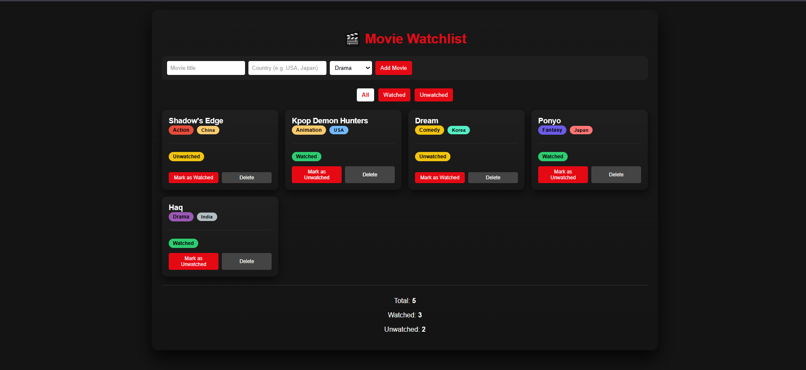

# 🎬 Movie Watchlist Manager

A React-based Movie Watchlist app where users can add movies, track watched status, filter the list, and view live statistics.

This project was built as part of a **Week 2 React assignment**, focusing on core React fundamentals such as **state, events, lists, keys, conditional rendering, and derived state**.

---

## ✨ Features

- **Add Movies**
  - Enter a movie title
  - Select a genre
  - Add a country of origin

- **Watch Status**
  - Mark movies as watched or unwatched
  - Visual status badges for clarity

- **Filtering**
  - View **All**, **Watched**, or **Unwatched** movies

- **Movie Management**
  - Delete movies from the list
  - Toggle watched status with one click

- **Live Summary (Derived State)**
  - Total movies
  - Watched movies count
  - Unwatched movies count
  - 🎉 Celebration message when all movies are watched

- **Styled UI**
  - Dark theme inspired layout
  - Genre and country color badges
  - Responsive grid layout

---

## 📸 Screenshot

---

## 🛠️ Built With

- React
- JavaScript (ES6+)
- CSS (custom styling, gradients, badges)
